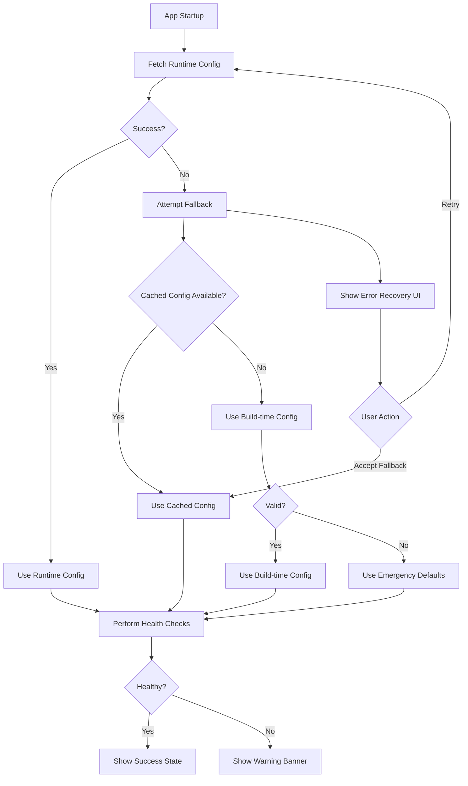

# Configuration Error Recovery System

This document describes the comprehensive configuration error recovery and user feedback system implemented for Supabase Studio.

## Overview

The configuration error recovery system provides graceful degradation when runtime configuration fails, ensuring the application remains functional while providing clear user feedback and troubleshooting guidance.

## Key Components

### 1. ConfigurationErrorRecovery Component

**Location:** `components/interfaces/App/ConfigurationErrorRecovery.tsx`

A comprehensive React component that displays configuration errors with:
- User-friendly error messages
- Progressive disclosure of technical details
- Troubleshooting suggestions
- Recovery actions (retry, fallback)
- Health check information
- Graceful degradation indicators

**Features:**
- Adaptive styling based on error severity
- Collapsible technical details
- Context-aware troubleshooting steps
- Integration with health check results
- Support for different error types

### 2. Configuration Fallback Service

**Location:** `lib/configuration-fallback.ts`

Handles graceful degradation strategies when runtime configuration fails:

**Fallback Strategies (in order):**
1. **Cached Configuration** - Uses previously successful configuration from localStorage
2. **Build-time Configuration** - Falls back to environment variables compiled at build time
3. **Emergency Defaults** - Uses hardcoded localhost defaults as last resort

**Key Functions:**
- `attemptConfigurationFallback()` - Attempts fallback strategies
- `validateFallbackConfiguration()` - Validates fallback configuration
- `explainConfigurationLimitations()` - Provides user-friendly explanations
- `cacheConfiguration()` - Caches successful configurations

### 3. Configuration Manager

**Location:** `lib/configuration-manager.ts`

Coordinates configuration loading, error recovery, and user feedback:

**Features:**
- Automatic retry with exponential backoff
- Health check integration
- Configuration caching
- Error recovery coordination
- User feedback management
- React hook for easy integration

**Hook Usage:**
```typescript
const configManager = useConfigurationManager({
  maxRetries: 3,
  retryDelay: 2000,
  enableHealthChecks: true,
  enableCaching: true,
  autoRetry: true,
})
```

### 4. Enhanced Error Types

**Location:** `packages/common/runtime-config-errors.ts`

Comprehensive error handling with:
- User-friendly error messages
- Troubleshooting suggestions
- Environment-specific guidance
- Fallback capability indicators
- Documentation links

**Error Types:**
- `NETWORK_TIMEOUT` - Request timeouts
- `NETWORK_ERROR` - Network connectivity issues
- `INVALID_RESPONSE` - Malformed server responses
- `MISSING_ENV_VARS` - Missing environment variables
- `INVALID_URL` - Invalid URL configurations
- `SERVER_ERROR` - Server-side errors
- `UNKNOWN` - Unexpected errors

## User Experience

### Error Display Hierarchy

1. **Critical Errors** (Red) - Prevent application functionality
2. **Warnings** (Orange) - Application works with limitations
3. **Info** (Blue) - Informational messages

### Progressive Disclosure

- **Summary** - Brief, user-friendly error description
- **Troubleshooting** - Expandable step-by-step guidance
- **Technical Details** - Collapsible technical information
- **Health Status** - System health check results

### Recovery Actions

- **Retry** - Attempt to reload configuration
- **Use Fallback** - Accept fallback configuration
- **Refresh** - Force refresh configuration cache

## Configuration Sources

### Runtime Configuration (Optimal)
- Fetched from `/api/runtime-config` at startup
- Can be updated without rebuilding
- Adapts to environment changes

### Build-time Configuration (Fallback)
- Environment variables compiled at build time
- Cannot change without rebuild
- Reliable but inflexible

### Emergency Defaults (Last Resort)
- Hardcoded localhost URLs
- Only works for local development
- Prevents complete application failure

## Error Recovery Flow



## Implementation Details

### Integration with _app.tsx

The error recovery system is integrated into the main application component:

```typescript
// Use configuration manager
const configManager = useConfigurationManager({
  maxRetries: 3,
  retryDelay: 2000,
  enableHealthChecks: true,
  enableCaching: true,
  autoRetry: true,
})

// Show appropriate UI based on state
{showConfigError && configManager.error && (
  <ConfigurationErrorRecovery
    error={configManager.error}
    healthResult={configManager.healthResult}
    isRetrying={configManager.isRetrying}
    onRetry={handleRetry}
    onUseFallback={handleUseFallback}
    canUseFallback={configManager.error.canFallback}
  />
)}
```

### Environment-Specific Behavior

**Development:**
- Uses localhost defaults
- Provides development-specific troubleshooting
- Less strict validation

**Production:**
- Validates against localhost URLs
- Provides production-specific guidance
- Stricter error handling

**Staging:**
- Balanced approach between dev and prod
- Environment-specific troubleshooting

### Caching Strategy

- **Cache Key:** `supabase_studio_cached_config`
- **Expiration:** 24 hours
- **Storage:** localStorage (with error handling)
- **Validation:** URL format and environment checks

### Health Checks

The system performs comprehensive health checks:

1. **Runtime Config Availability** - Can fetch configuration
2. **GoTrue Service Reachability** - Authentication service is accessible
3. **API Gateway Reachability** - Main API is accessible

Health check results are displayed to users with actionable guidance.

### Logging and Debugging

All configuration operations are logged with:
- Configuration source tracking
- Failed request URL logging
- Environment-specific guidance
- Troubleshooting suggestions
- Performance metrics

### Testing

The system includes comprehensive tests:
- Unit tests for error handling
- Integration tests for fallback strategies
- Property-based tests for validation
- End-to-end tests for user flows

## Troubleshooting Guide

### Common Issues

**1. Network Timeout Errors**
- Check network connectivity
- Verify server is running
- Check firewall settings

**2. Invalid Configuration Response**
- Check server environment variables
- Verify API endpoint is working
- Check server logs

**3. Missing Environment Variables**
- Set required environment variables
- Restart server after changes
- Check environment variable names

**4. Localhost URLs in Production**
- Set SUPABASE_PUBLIC_URL
- Set API_EXTERNAL_URL
- Verify environment detection

### Debug Mode

Enable debug logging:
```javascript
// In browser console
localStorage.setItem('config-debug', 'true')
```

This provides detailed logging of:
- Configuration resolution steps
- URL validation results
- Fallback strategy decisions
- Health check details

## Best Practices

### For Developers

1. **Always handle configuration errors gracefully**
2. **Provide clear, actionable error messages**
3. **Test fallback scenarios thoroughly**
4. **Monitor configuration health in production**
5. **Use environment-specific guidance**

### For Deployment

1. **Set explicit environment variables for production**
2. **Test configuration in target environment**
3. **Monitor health check endpoints**
4. **Have fallback strategies ready**
5. **Document environment-specific setup**

### For Users

1. **Check network connectivity first**
2. **Try refreshing the page**
3. **Check browser console for details**
4. **Contact support with error details**
5. **Use fallback mode if available**

## Future Enhancements

- **Real-time configuration updates** - WebSocket-based config updates
- **Configuration validation API** - Server-side validation endpoint
- **Advanced retry strategies** - Circuit breaker pattern
- **Configuration history** - Track configuration changes over time
- **Performance monitoring** - Configuration load time metrics